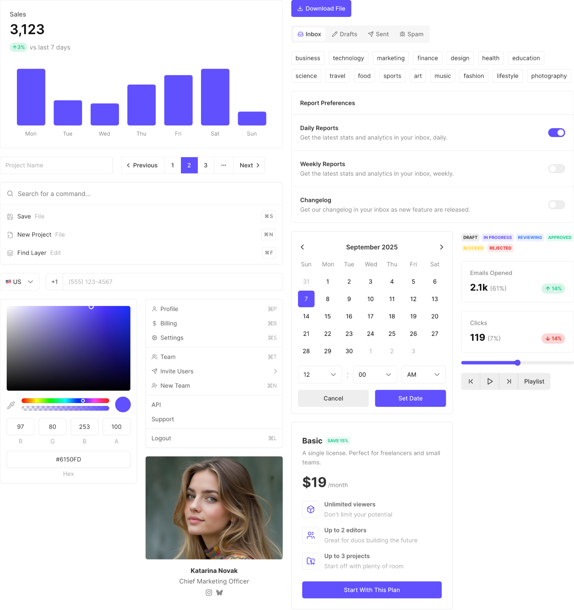

### The CSS framework for SaaS apps

Mod is a collection of base styles and components for building your SaaS app's UI. The free version of Mod (this repo) contains a limited set of components for building your UI.

For a larger collection of components (that grows monthly), check out [Mod Plus](https://mod.cheatcode.co/plus?utm_source=github&utm_medium=readme&utm_campaign=readme_clicks).

[Browse Components](https://mod.cheatcode.co/components?utm_source=github&utm_medium=readme&utm_campaign=readme_clicks)

 

## Documentation

[Browse all of the components](https://mod.cheatcode.co/components?utm_source=github&utm_medium=readme&utm_campaign=readme_clicks) or [view the documentation](https://docs.cheatcode.co/mod?utm_source=github&utm_medium=readme&utm_campaign=readme_clicks).

## Contributing

Mod is not seeking contributors.

## License

Licensed under the [MIT license](https://github.com/cheatcode/mod/blob/main/LICENSE.md).